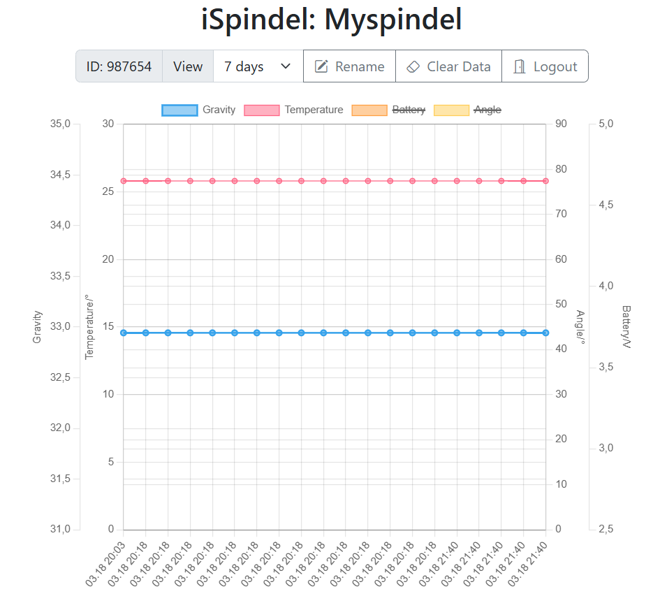

# iSpindel Visualizer
  
The iSpindel Visualizer is a simple, easy to use chart display of [iSpindel](https://www.ispindel.de) measurement data using PHP, MySQL, Bootstrap and chart.js.

The intention was to create an extremely simple tool which stores the data which is sent by the iSpindel HTTPS POST and displaying it without any registration and special cloud service.

  
  
## Installation

1. Create a database as in the **sql_structure.sql**

2. Configure the database connection in the **configuration.php**

## Usage

  In the iSpindel configuration select **HTTPS Post**, as server address use the address of the server on which the visualizer is installed. It also works great on a local XAMPP installation.

As path use **/update.php?key=...**

The key is a kind of a password to protect your data. You can use any alphanumerical sequence and special characters with any length. Example: sz89Bd96$iogf

The first time a iSpindel connects, it will automatically registered and the key will be stored for future key checks and logins.

  

  The system use the iSpindle ID for accessing its data. You can find it on the information page of the iSpindel.
The name which is stored in the iSpindel will be used for its alias name.

  

## Accessing Data

To access your data, simply log-in using your iSpindel ID and your self chosen key.

## Security

There is a minor security encrypting the spindle's key in the database.

## Todo

- Adding feature of renaming the alias of a iSpindel
- Ajax steaming and refreshing data if new data is available

The project was mainly done for practicing PHP coding.
